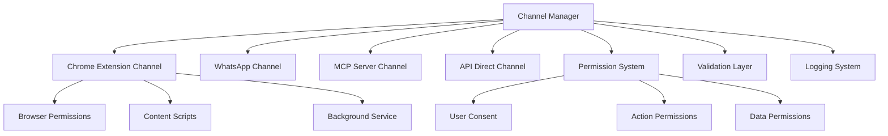

# Channels Architecture

Los **Canales** son la infraestructura central que permite a PAME.AI conectarse con diferentes aplicaciones y servicios, proporcionando acceso controlado a información y funcionalidades externas.

## 🌟 Características Principales

<CardGroup cols={2}>
  <Card title="Control de Permisos Granular" icon="shield-check">
    Sistema de permisos detallado que permite controlar exactamente qué datos puede acceder cada canal
  </Card>
  
  <Card title="Arquitectura Extensible" icon="puzzle-piece">
    Diseño modular que permite agregar nuevos tipos de canales fácilmente
  </Card>
  
  <Card title="Monitoreo en Tiempo Real" icon="chart-line">
    Seguimiento completo de actividades y eventos de cada canal
  </Card>
  
  <Card title="Seguridad Avanzada" icon="lock">
    Encriptación end-to-end y validación de integridad de datos
  </Card>
</CardGroup>

## 🔌 Canales Disponibles

### Chrome Extension Channel 🌐
Proporciona acceso completo al navegador Chrome con control granular de permisos.

**Capacidades:**
- Acceso a pestañas abiertas
- Extracción de contenido de páginas
- Historial de navegación
- Marcadores del usuario
- Inyección de scripts
- Capturas de pantalla

**Permisos:**
- `browser:tabs` - Información de pestañas
- `browser:content` - Contenido de páginas
- `browser:history` - Historial de navegación
- `browser:bookmarks` - Marcadores
- `browser:inject` - Inyección de scripts

### Próximamente 🚧

<AccordionGroup>
  <Accordion title="WhatsApp Channel">
    Integración completa con WhatsApp para envío y recepción de mensajes, gestión de contactos y automatización de conversaciones.
  </Accordion>
  
  <Accordion title="MCP Server Channel">
    Protocolo de Contexto de Modelo para integración con servidores de AI y herramientas de desarrollo.
  </Accordion>
  
  <Accordion title="API Direct Channel">
    Acceso directo a APIs externas con gestión automática de autenticación y rate limiting.
  </Accordion>
</AccordionGroup>

## 🚀 Inicio Rápido

### 1. Instalación

```bash
npm install @pame-ai/core
```

### 2. Configuración Básica

<Tabs>
  <Tab title="JavaScript">
    ```javascript
    const ChannelManager = require('@pame-ai/core/channels');
    
    // Crear gestor de canales
    const channelManager = new ChannelManager({
      maxChannels: 10,
      sessionTimeout: 3600000, // 1 hora
      auditEnabled: true
    });
    ```
  </Tab>
  
  <Tab title="TypeScript">
    ```typescript
    import { ChannelManager } from '@pame-ai/core/channels';
    
    // Crear gestor de canales con tipos
    const channelManager = new ChannelManager({
      maxChannels: 10,
      sessionTimeout: 3600000,
      auditEnabled: true
    });
    ```
  </Tab>
</Tabs>

### 3. Registrar Canal Chrome Extension

```javascript
// Registrar canal
await channelManager.registerChannel('my-browser', {
  type: 'chrome-extension',
  permissions: [
    'browser:tabs',
    'browser:content', 
    'browser:history'
  ],
  manifestVersion: 3
});

// Obtener canal
const chromeChannel = channelManager.getChannel('my-browser');
```

### 4. Usar el Canal

```javascript
// Obtener pestañas activas
const tabs = await chromeChannel.executeAction('getTabs', {
  active: true
});

// Analizar página actual
const pageInfo = await chromeChannel.executeAction('getPageInfo', {
  tabId: tabs[0].id
});

console.log('Página actual:', pageInfo.title);
console.log('Contenido:', pageInfo.textContent.substring(0, 200));
```

## 🏗️ Arquitectura del Sistema



## 🛡️ Sistema de Permisos

### Categorías de Permisos

<Tabs>
  <Tab title="Básicos">
    - **`read`** - Lectura de información
    - **`write`** - Modificación de datos  
    - **`execute`** - Ejecución de acciones
  </Tab>
  
  <Tab title="Navegador">
    - **`browser:tabs`** - Acceso a pestañas
    - **`browser:content`** - Contenido de páginas
    - **`browser:history`** - Historial de navegación
    - **`browser:bookmarks`** - Marcadores
    - **`browser:inject`** - Inyección de scripts
  </Tab>
  
  <Tab title="Mensajería">
    - **`messaging:send`** - Enviar mensajes
    - **`messaging:receive`** - Recibir mensajes
    - **`messaging:contacts`** - Lista de contactos
  </Tab>
  
  <Tab title="Red y Almacenamiento">
    - **`network`** - Conexiones de red
    - **`storage`** - Almacenamiento local
    - **`api:call`** - Llamadas a APIs externas
  </Tab>
</Tabs>

### Flujo de Consentimiento

<Steps>
  <Step title="Solicitud de Permisos">
    El canal solicita permisos específicos al registrarse
  </Step>
  
  <Step title="Validación del Sistema">
    Se validan los permisos y dependencias automáticamente
  </Step>
  
  <Step title="Consentimiento del Usuario">
    Se presenta al usuario un prompt detallado con los permisos solicitados
    
    <Warning>
    Los permisos sensibles requieren confirmación explícita del usuario
    </Warning>
  </Step>
  
  <Step title="Otorgamiento y Seguimiento">
    Los permisos se otorgan con fecha de expiración y se auditan todas las acciones
  </Step>
</Steps>

## 💡 Casos de Uso

### Análisis de Contenido Web

```javascript
async function analyzeWebContent() {
  const chrome = channelManager.getChannel('browser');
  
  // Obtener página actual
  const activeTab = await chrome.executeAction('getActiveTab');
  const pageInfo = await chrome.executeAction('getPageInfo', {
    tabId: activeTab.id
  });
  
  // Análisis básico
  const analysis = {
    wordCount: pageInfo.textContent.split(' ').length,
    linkCount: pageInfo.links.length,
    imageCount: pageInfo.images.length,
    hasVideo: pageInfo.textContent.includes('video'),
    category: categorizeContent(pageInfo)
  };
  
  return analysis;
}
```

### Automatización de Navegación

```javascript
async function automateWebTasks() {
  const chrome = channelManager.getChannel('browser');
  
  // Crear nueva pestaña
  const newTab = await chrome.executeAction('createTab', {
    url: 'https://example.com',
    active: true
  });
  
  // Esperar carga y ejecutar script
  await new Promise(resolve => setTimeout(resolve, 2000));
  
  const result = await chrome.executeAction('executeScript', {
    tabId: newTab.id,
    code: `
      // Llenar formulario automáticamente
      const form = document.querySelector('form');
      if (form) {
        const emailInput = form.querySelector('[type="email"]');
        if (emailInput) emailInput.value = 'usuario@ejemplo.com';
      }
      
      // Retornar estado
      ({ success: true, forms: document.forms.length })
    `
  });
  
  return result;
}
```

### Monitoreo de Actividad

```javascript
// Configurar event listeners
chrome.on('data', (data) => {
  switch (data.type) {
    case 'tab_updated':
      console.log('📄 Nueva página:', data.data.url);
      trackPageVisit(data.data);
      break;
      
    case 'navigation_completed':
      console.log('🧭 Navegación completada:', data.data.url);
      analyzeUserBehavior(data.data);
      break;
  }
});
```

## 📊 Monitoreo y Estadísticas

### Métricas del Canal Manager

```javascript
const stats = channelManager.getStats();

console.log('📈 Estadísticas:');
console.log(`- Canales activos: ${stats.activeChannels}/${stats.totalChannels}`);
console.log(`- Tipos de canales: ${Object.keys(stats.channelTypes).join(', ')}`);
console.log(`- Total permisos: ${stats.totalPermissions}`);
```

### Métricas por Canal

```javascript
const channelInfo = chrome.getInfo();

console.log('🔌 Estado del canal:');
console.log(`- Estado: ${channelInfo.status}`);
console.log(`- Última actividad: ${channelInfo.lastActivity}`);
console.log(`- Permisos: ${channelInfo.permissions.join(', ')}`);
```

## 🔧 Configuración Avanzada

### Configuración de Timeouts

```javascript
const channelManager = new ChannelManager({
  maxChannels: 20,
  sessionTimeout: 7200000, // 2 horas
  encryptionEnabled: true,
  auditEnabled: true
});
```

### Configuración de Canal Específica

```javascript
await channelManager.registerChannel('browser-advanced', {
  type: 'chrome-extension',
  extensionId: 'your-extension-id',
  manifestVersion: 3,
  timeout: 30000,
  retryAttempts: 3,
  permissions: [
    'browser:tabs',
    'browser:content',
    'browser:inject',
    'storage:persistent'
  ]
});
```

## 🚨 Manejo de Errores

### Errores Comunes

<AccordionGroup>
  <Accordion title="Canal No Encontrado">
    ```javascript
    try {
      const channel = channelManager.getChannel('invalid-id');
    } catch (error) {
      if (error.message.includes('Channel not found')) {
        console.log('❌ Canal no registrado');
        // Registrar canal automáticamente
      }
    }
    ```
  </Accordion>
  
  <Accordion title="Permisos Insuficientes">
    ```javascript
    try {
      await channel.executeAction('sensitiveAction');
    } catch (error) {
      if (error.message.includes('Permission denied')) {
        console.log('🚫 Permisos insuficientes');
        // Solicitar permisos adicionales
      }
    }
    ```
  </Accordion>
  
  <Accordion title="Timeout de Conexión">
    ```javascript
    try {
      await channel.ping();
    } catch (error) {
      if (error.message.includes('timeout')) {
        console.log('⏰ Conexión lenta - reintentando...');
        await channel.attemptReconnect();
      }
    }
    ```
  </Accordion>
</AccordionGroup>

## 📚 Recursos Adicionales

<CardGroup cols={2}>
  <Card title="Chrome Extension Guide" href="/channels/chrome-extension" icon="chrome">
    Guía completa para el canal de Chrome Extension
  </Card>
  
  <Card title="API Reference" href="/api-reference/channels" icon="code">
    Referencia completa de la API de canales
  </Card>
  
  <Card title="Examples" href="/channels/examples" icon="lightbulb">
    Ejemplos prácticos de uso de canales
  </Card>
  
  <Card title="Security Guide" href="/channels/security" icon="shield">
    Guía de seguridad y mejores prácticas
  </Card>
</CardGroup>

## ⚡ Próximos Pasos

1. **[Instalar y configurar](/channels/installation)** tu primer canal
2. **[Explorar ejemplos](/channels/examples)** de uso práctico
3. **[Configurar permisos](/channels/permissions)** granulares
4. **[Integrar con tu aplicación](/channels/integration)** existente

<Tip>
¿Necesitas ayuda? Únete a nuestra [comunidad](https://discord.gg/pame-ai) o consulta nuestros [ejemplos en GitHub](https://github.com/ai-factory-llc/pame-ai/tree/main/core/channels/examples).
</Tip> 