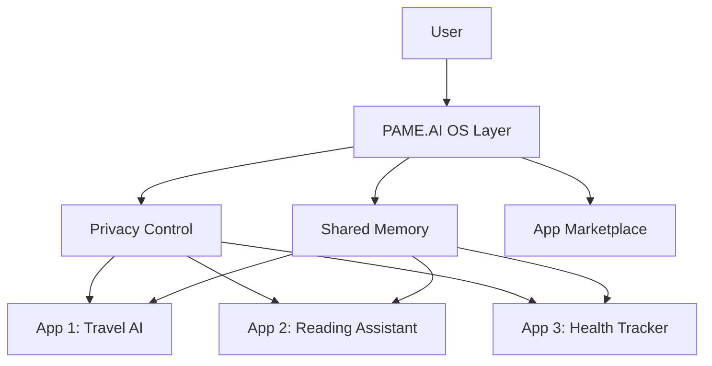

## What is PAME.AI?

PAME.AI (Personal AI Memory & Environment) is a revolutionary AI operating system and app store that addresses the five key requirements outlined by Y Combinator:

<CardGroup cols={2}>
  <Card
    title="🔐 Privacy-First Data Control"
    icon="shield-halved"
    href="/core/privacy-control"
  >
    Users control exactly what data each AI app can access - calendar, files, browsing history - with granular permissions
  </Card>
  <Card
    title="🧠 Shared Memory System"
    icon="brain"
    href="/core/shared-memory"
  >
    All personal details, preferences, and context stay in one secure layer, not scattered across dozens of apps
  </Card>
  <Card
    title="🏪 Curated App Marketplace"
    icon="store"
    href="/core/app-marketplace"
  >
    Discover and install vetted AI tools safely with reviews, ratings, and security guarantees
  </Card>
  <Card
    title="🛠️ Developer Platform"
    icon="code"
    href="/core/developer-platform"
  >
    Simple APIs that make building AI apps with memory easier, plus built-in safety rules
  </Card>
  <Card
    title="💳 Integrated Payments"
    icon="credit-card"
    href="/core/payments"
  >
    Seamless payment processing for paid apps and services with revenue sharing
  </Card>
</CardGroup>

## Why PAME.AI?

### For End Users
- **Privacy Control**: Your data stays yours. Grant permissions app-by-app
- **Unified Experience**: No more re-entering preferences in every AI tool
- **Trusted Apps**: All apps are reviewed and verified for safety
- **One Payment System**: Manage all subscriptions in one place

### For Developers
- **Rich Context API**: Access user preferences and history (with permission)
- **No Auth Hassle**: We handle user authentication and data storage
- **Built-in Monetization**: Focus on your app, we handle payments
- **Instant Distribution**: Reach users through our curated marketplace

## Quick Example

Imagine a travel AI that knows:
- You always travel with your 9-year-old who loves window seats
- You prefer morning flights
- You're vegetarian
- You have TSA PreCheck

With PAME.AI, this context is available to any travel app you authorize - no need to re-enter it every time.

## Architecture Overview



## Getting Started

<CardGroup cols={2}>
  <Card
    title="Quickstart Guide"
    icon="rocket"
    href="/quickstart"
  >
    Get your first app running in 5 minutes
  </Card>
  <Card
    title="Development Setup"
    icon="laptop-code"
    href="/development"
  >
    Set up your local development environment
  </Card>
  <Card
    title="API Reference"
    icon="book"
    href="/api-reference/introduction"
  >
    Explore our comprehensive API documentation
  </Card>
  <Card
    title="Example Apps"
    icon="flask"
    href="https://github.com/ai-factory-llc/pame-ai-examples"
  >
    Learn from example applications
  </Card>
</CardGroup>

## Join Our Community

<CardGroup cols={3}>
  <Card
    title="GitHub"
    icon="github"
    href="https://github.com/ai-factory-llc/pame-ai"
  >
    Star us on GitHub
  </Card>
  <Card
    title="Discord"
    icon="discord"
    href="https://discord.gg/pame-ai"
  >
    Chat with developers
  </Card>
  <Card
    title="Twitter"
    icon="twitter"
    href="https://twitter.com/pame_ai"
  >
    Follow for updates
  </Card>
</CardGroup>

## Ready to Build?

<Tabs>
  <Tab title="I'm a Developer">
    Start building your AI app with shared memory:
    ```bash
    npm install @pame-ai/sdk
    npx pame-ai init my-first-app
    cd my-first-app
    npm run dev
    ```
    [Continue to Quickstart →](/quickstart)
  </Tab>
  <Tab title="I'm a User">
    Download PAME.AI to start using privacy-focused AI apps:
    
    <CardGroup cols={2}>
      <Card title="Download for Mac" icon="apple" href="https://download.pame.ai/mac" />
      <Card title="Download for Windows" icon="windows" href="https://download.pame.ai/windows" />
      <Card title="Download for Linux" icon="linux" href="https://download.pame.ai/linux" />
      <Card title="Mobile Coming Soon" icon="mobile" />
    </CardGroup>
  </Tab>
</Tabs>

---

Built with ❤️ by [AI Factory LLC](https://aifactory.llc) 