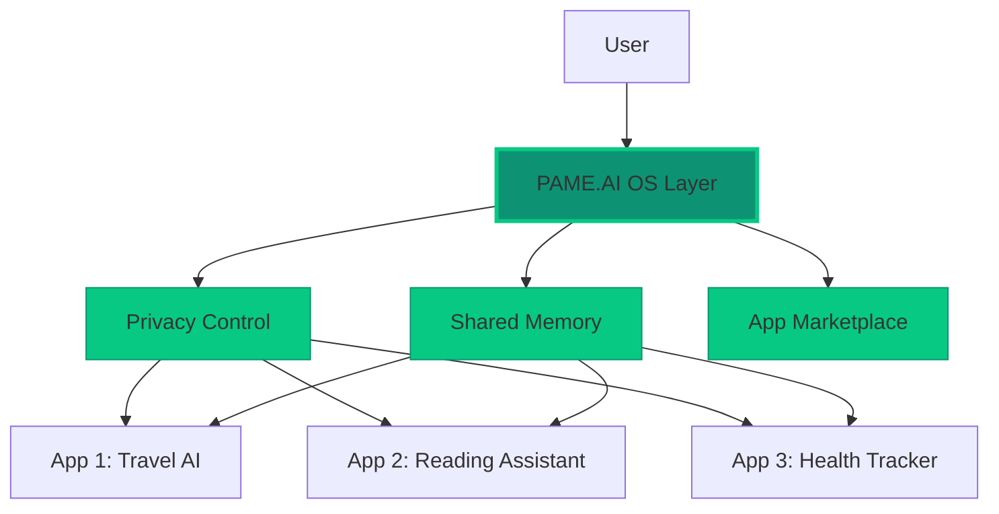

## What is PAME.AI?

PAME.AI (Personal AI Memory & Environment) is building the revolutionary AI operating system and app store that addresses the five key requirements outlined by Y Combinator:

<CardGroup cols={2}>
  <Card
    title="🔐 Privacy-First Data Control"
    icon="shield-halved"
    href="/core/privacy-control"
  >
    Users control exactly what data each AI app can access - calendar, files, browsing history - with granular permissions
  </Card>
  <Card
    title="🧠 Shared Memory System"
    icon="brain"
    href="/core/shared-memory"
  >
    All personal details, preferences, and context stay in one secure layer, not scattered across dozens of apps
  </Card>
  <Card
    title="🏪 Curated App Marketplace"
    icon="store"
    href="/core/app-marketplace"
  >
    Discover and install vetted AI tools safely with reviews, ratings, and security guarantees
  </Card>
  <Card
    title="🛠️ Developer Platform"
    icon="code"
    href="/core/developer-platform"
  >
    Simple APIs and CLI tools that make building AI apps easier, with built-in best practices
  </Card>
  <Card
    title="💳 Integrated Payments"
    icon="credit-card"
    href="/core/payments"
  >
    Seamless payment processing for paid apps and services with revenue sharing
  </Card>
</CardGroup>

## Current Platform Status

<Info>
PAME.AI is in active development. Our CLI tools and core infrastructure are available now for developers to start building the future of AI applications.
</Info>

### ✅ Available Now

- **Developer CLI**: Build and deploy AI applications with `@pameai/cli`
- **Multi-AI Provider Support**: OpenAI, Anthropic, Google, Perplexity integrations
- **Authentication System**: Secure auth for your AI applications
- **Deployment Infrastructure**: Deploy to PAME subdomains or your own
- **Project Templates**: Quick-start with AI chatbot, auth webapp, and more

### 🚧 In Development

- Full shared memory API implementation
- App marketplace and review system
- Payment processing integration
- Desktop and mobile applications
- Advanced permission management

## Why PAME.AI?

### For End Users (Coming Soon)
- **Privacy Control**: Your data stays yours. Grant permissions app-by-app
- **Unified Experience**: No more re-entering preferences in every AI tool
- **Trusted Apps**: All apps are reviewed and verified for safety
- **One Payment System**: Manage all subscriptions in one place

### For Developers (Available Now)
- **Quick Start**: Get an AI app running in minutes with our CLI
- **Best Practices Built-in**: Authentication, security, and deployment handled
- **Multi-Provider AI**: Support multiple AI providers out of the box
- **Professional Infrastructure**: Enterprise-grade deployment and scaling

## Developer Preview

Get started building AI applications on the PAME platform today:

<Steps>
<Step title="Install the CLI">
    ```bash
    npm install -g @pameai/cli
    ```
</Step>

<Step title="Create your first app">
    ```bash
    pame create my-ai-app --template ai-chatbot
    cd my-ai-app
    ```
</Step>

<Step title="Start developing">
    ```bash
    npm install
    npm run dev
    ```
</Step>

<Step title="Deploy to production">
    ```bash
    pame deploy
    ```
</Step>
</Steps>

## Architecture Vision



## Example Use Case

Imagine a travel AI that knows:
- You always travel with your 9-year-old who loves window seats
- You prefer morning flights
- You're vegetarian
- You have TSA PreCheck

With PAME.AI, this context will be available to any travel app you authorize - no need to re-enter it every time.

## Getting Started

<CardGroup cols={2}>
  <Card
    title="Quickstart Guide"
    icon="rocket"
    href="/quickstart"
  >
    Build your first AI app in 5 minutes
  </Card>
  <Card
    title="NPM Package"
    icon="npm"
    href="https://www.npmjs.com/package/@pameai/cli"
  >
    View our public CLI package
  </Card>
  <Card
    title="API Reference"
    icon="book"
    href="/api-reference/introduction"
  >
    Explore planned API documentation
  </Card>
  <Card
    title="GitHub Repository"
    icon="github"
    href="https://github.com/alecaifactory/pame.ai"
  >
    View source code and contribute
  </Card>
</CardGroup>

## Join Our Community

<CardGroup cols={3}>
  <Card
    title="GitHub"
    icon="github"
    href="https://github.com/alecaifactory/pame.ai"
  >
    Star us on GitHub
  </Card>
  <Card
    title="Discord"
    icon="discord"
    href="https://discord.gg/pame-ai"
  >
    Chat with developers
  </Card>
  <Card
    title="Twitter"
    icon="twitter"
    href="https://twitter.com/pame_ai"
  >
    Follow for updates
  </Card>
</CardGroup>

## Ready to Build?

<Tabs>
  <Tab title="I'm a Developer">
    Start building your AI app today:
    ```bash
    # Install the PAME CLI
    npm install -g @pameai/cli
    
    # Create your first app
    pame create my-first-app --template ai-chatbot
    
    # Start developing
    cd my-first-app
    npm install
    npm run dev
    ```
    
    [Continue to Quickstart →](/quickstart)
  </Tab>
  <Tab title="I'm an Early Adopter">
    <Note>
    The PAME.AI user applications are in development. Join our waitlist to be notified when they're ready!
    </Note>
    
    <Card
      title="Join the Waitlist"
      icon="envelope"
      href="https://pame.ai/#waitlist"
    >
      Be the first to know when PAME.AI launches
    </Card>
  </Tab>
</Tabs>

## Our Mission

We're building the AI operating system that Y Combinator envisioned - where AI can be both powerful and private. Where developers can build amazing experiences without compromising user trust. Where users maintain control of their data while benefiting from personalized AI assistance.

<Tip>
**For Developers**: Start building on PAME today with our CLI tools. Be part of the revolution.

**For Users**: The full PAME experience is coming soon. Your data, your control, your AI.
</Tip>

---

Built with ❤️ by [AI Factory LLC](https://ai-factory.com) 